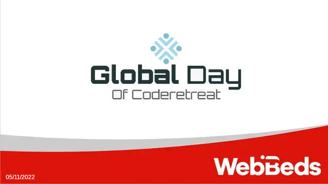

# WebBeds' Global Day of Coderetreat

We return with the [Global Day of Coderetreat](http://www.coderetreat.org). This year sponsored by [Webbeds](https://www.webbeds.com/).

If you've never been to a Coderetreat, it's an entire day dedicated to practicing the fundamentals of software development.

During the event, the participants will have the opportunity to focus on practicing, without worrying about time, day-to-day pressure and without fear of making mistakes.

This type of format was designed to effectively enhance all of our abilities through repetition. All this helps participants to be flexible in the face of change and reduce the cost of developing good code in our day-to-day lives.

The event is divided into different sessions, each session contributes to improving the next. At each iteration we will switch partners and delete all the code. The idea is that we always use TDD, the goal is to improve our skills.

Each pair will choose the language they want to solve [Conway's Game of Life](http://codingdojo.org/kata/GameOfLife/). Each iteration will be an opportunity to make changes, always looking for what contributes the most to us. In addition, in each iteration we will add an activity or restriction that will make the event much more enjoyable.
